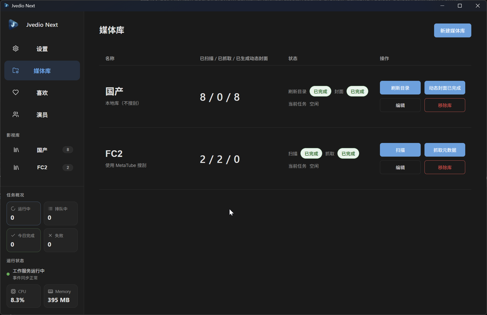
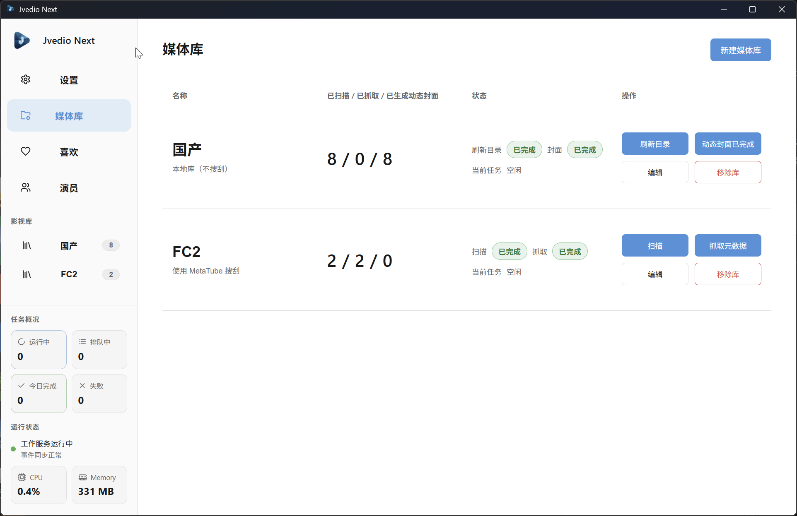
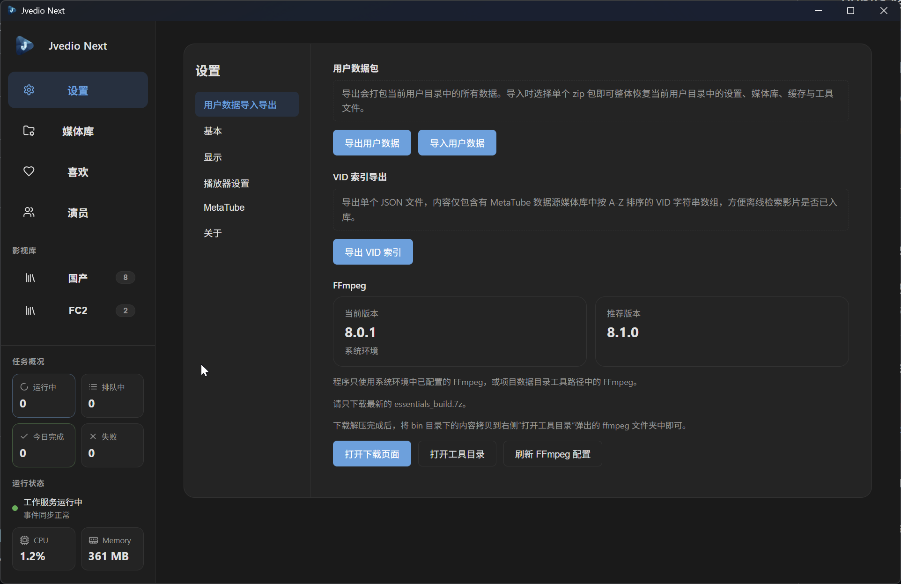
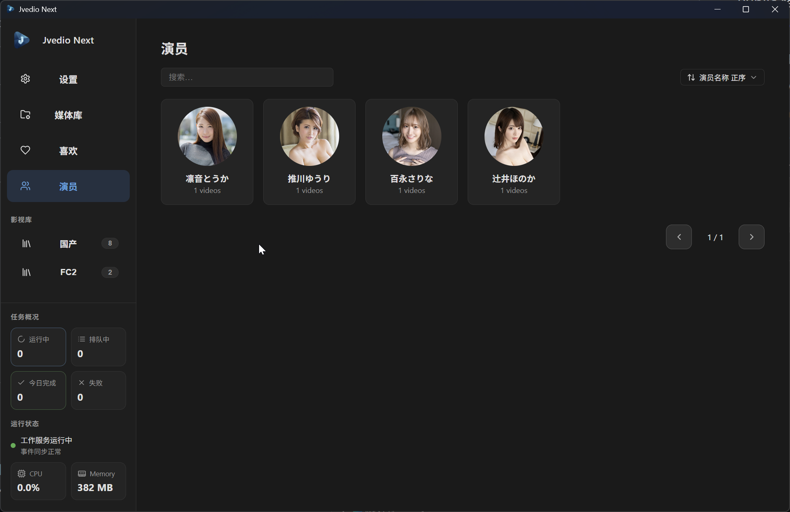
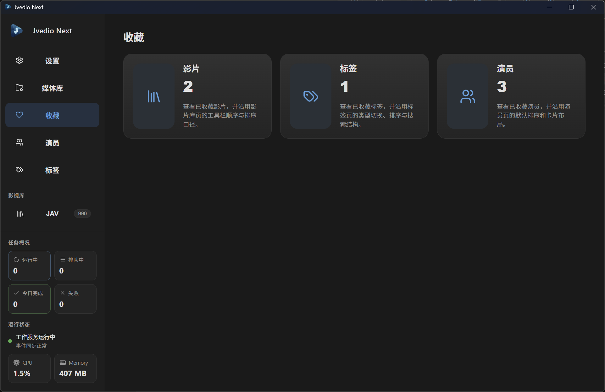
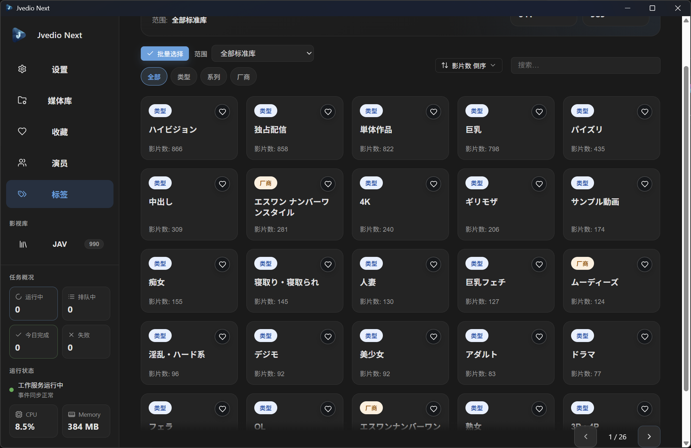

<h1 align="center">
  
  <br>
  JvedioNext
</h1>

<p align="center">
  次世代离线影片管理工具，标准番号库、非规则本地资源与 `.strm` 远程索引统一管理
</p>

<p align="center">
  <a href="./CHANGELOG.md">版本更新记录</a>
  ·
  <a href="https://github.com/spartawhy117/JvedioNext/releases/latest">最新版本下载</a>
</p>

<p align="center">
  
  
  
  
  <a href="https://github.com/spartawhy117/JvedioNext/releases/latest">
    
  </a>
  <a href="https://github.com/spartawhy117/JvedioNext">
    
  </a>
</p>

- **标准库**：扫描整理番号目录，抓取海报、`NFO`、演员与详情，并支持规范命名的 `.strm`
- **非标准本地库**：不改原目录结构，通过合集目录列表与动态封面管理散装资源
- **库健康**：提供单库健康诊断页，集中查看抓取状态、资源缺口、规则问题、失效记录和分组一致性
- **用户数据**：支持导入导出打包（含封面缓存），迁移无需重新抓取
- **索引辅助**：支持 `VID` 列表导出，便于离线确认影片是否已入库

---

## 适合这些场景

- 你有一套按番号整理或准备整理的标准影片目录，希望自动补齐元数据和 sidecar
- 你有一批网盘导出的规范 `.strm` 文件，希望继续进入海报墙、详情页和随机选片
- 你有大量散装本地资源或合集目录，希望不改原目录也能做浏览和管理

---

## 快速查看

### 新用户先看

- [环境准备](#environment)
- [两种库模式速览](#library-modes-quick)
- [`.strm` 支持速览](#strm-quick)

### 功能预览

- [预览](#preview)
- [库健康页概览](#library-health-overview)
- [设置页概览](#settings-overview)
- [收藏页概览](#favorites-overview)
- [标签页浏览](#tags-overview)

### 详细规则

- [库模式详细说明](#library-modes-detail)

### 其他

- [致谢](#acknowledgements)
- [特别声明](#disclaimer)
- [赞助开发者喝奶茶](#support)

---

<a id="environment"></a>
## ⚠️ 首次启动前请先准备环境

默认推荐安装 `x64` 版本；如果你的系统是 `32` 位 Windows，请自行改装对应的 `x86` 版本。

### ✅ 必选

- `.NET 8 ASP.NET Core Runtime (Windows x64)`：
  [官方直达下载（v8.0.25 x64）](https://dotnet.microsoft.com/zh-cn/download/dotnet/thank-you/runtime-aspnetcore-8.0.25-windows-x64-installer)
- `.NET 8 Desktop Runtime (Windows x64)`：
  [官方直达下载（v8.0.25 x64）](https://dotnet.microsoft.com/zh-cn/download/dotnet/thank-you/runtime-desktop-8.0.25-windows-x64-installer)

缺少以上任一 `.NET 8` 运行时，`Jvedio.Worker.exe` 都可能无法正常启动，通常会看到：

```text
引擎启动失败
Worker process exited unexpectedly

请检查 Worker 是否可用后重启应用
```

应用启动后，如果你要使用标准库的元数据抓取功能，还需要准备 `MetaTube` 服务地址：

- `MetaTube`
  - `JvedioNext` 不内置公共 `MetaTube` 后端
  - 准备好后，把服务地址填到软件设置页中的 `MetaTube 服务地址`
  - 自己搭建：
    - 可以先看 MetaTube 官方文档和官方项目主页，再按文档部署后端服务
    - [MetaTube 官方文档](https://metatube-community.github.io/)
    - [MetaTube 官方 GitHub](https://github.com/metatube-community)
    - 也可以搜索：`Huggingface Space MetaTube 搭建`
  - 寻找公共接口：
    - 如果你不想自己搭建，可以自行搜索可用的公共接口服务
    - 建议搜索这些关键词：
      - `MetaTube 部署`
      - `MetaTube Docker`
      - `MetaTube 服务地址`
      - `MetaTube 公共节点`

### 🧩 可选

- `Microsoft Edge WebView2 Runtime` [微软官方 WebView2 下载页](https://developer.microsoft.com/en-us/microsoft-edge/webview2)
  - Windows 10 和 Windows 11 一般已经自带或通过系统更新带有 `WebView2 Runtime`
  - 多数情况下不需要单独安装
  - 只有在前端窗口打不开、白屏或界面无法渲染时，再到这里补装

- `FFmpeg` [FFmpeg 下载页](https://github.com/GyanD/codexffmpeg/releases)
  - 只在"非标准本地库生成动态封面"时需要，不影响软件启动，也不影响标准库抓取元数据
  - 建议下载最新的 `essentials_build.zip`
  - 解压后，把 `bin` 目录下这 3 个文件拷贝到软件目录中的 `data/<user>/tools/ffmpeg/`
    - `ffmpeg.exe`
    - `ffprobe.exe`
    - `ffplay.exe`
  - 如果你不确定目录位置，可以先打开软件设置页中的 `打开工具目录`，再把这 3 个文件拷进去

---

<a id="library-modes-quick"></a>
## 两种库模式速览

| 模式 | 适合内容 | 元数据抓取 | 是否改原目录 |
| --- | --- | --- | --- |
| 标准库 | 规范番号影片、规范命名 `.strm` | ✅ MetaTube | ✅ 会整理到标准库结构 |
| 非标准本地库 | 合集盘、散装目录、非规则资源 | — | ❌ 只同步，不搬运 |

<a id="strm-quick"></a>
### `.strm` 支持速览

- 当前 `.strm` 支持只适用于 `MetaTube` 标准库
- `JvedioNext` 按 `.strm` 文件名识别影片，文件内容只支持单行绝对 `http/https` 地址
- 合法 `.strm` 可参与标准库扫描、海报墙、详情页和随机选片；若同名本地实体文件同时存在，则本地实体优先
- 最小写法规则：文件名需按标准番号命名，文件内容建议只保留一个最终播放地址；当前不支持本地路径、相对路径和其他协议内容

---

<a id="preview"></a>
## 预览

<p align="center">
  
  
</p>

<p align="center">
  
  
</p>

<p align="center">
  
  
</p>

---

<a id="library-health-overview"></a>
## 库健康页概览

- 入口：可从媒体库管理页的 `查看健康`，或单库页工具栏中的 `库健康` 进入。
- 页面内容：集中展示当前库的抓取状态、资源缺口、规则问题、失效记录和分组一致性；本地库会保留更贴近本地资源场景的三张诊断卡。
- 主要按钮：支持 `一键重抓并补资源`、`重新检查失效记录`、`查看文件规则问题`，并可在页面顶部直接 `刷新健康状态`。

---

<a id="settings-overview"></a>
## 设置页概览

| 分组 | 说明 |
| --- | --- |
| 用户数据导入导出 | 迁移、备份、恢复用户环境，含封面缓存和 VID 列表导出 |
| 基本 | 主题、语言、关闭行为、调试模式 |
| 显示 | 影片卡大小、影片库和演员页默认排序 |
| 播放器设置 | 自定义播放器路径，未配置时回退系统默认 |
| MetaTube | 服务地址、请求超时、连通性测试 |
| 关于 | 查看版本，跳转 GitHub Releases 获取更新 |

---

<a id="favorites-overview"></a>
## 收藏页概览

- 可以把影片、标签和演员统一加入收藏，集中管理常看内容
- 收藏首页会直接显示 `影片 / 标签 / 演员` 三类入口，方便按对象快速进入对应列表
- 收藏影片页支持搜索、排序、批量取消收藏和批量处理，适合整理常看片单
- 收藏标签页与收藏演员页支持查看收藏对象、快速取消收藏，并可继续按收藏对象回看关联影片

---

<a id="tags-overview"></a>
## 标签页浏览

- 可以按 `类型 / 系列 / 厂商 / 自定义` 浏览标签内容，其中自定义标签同时支持标准库与非标准库
- 自定义标签现已纳入同一套标签页浏览链路，标准库与非标准库都可以查看、收藏并继续展开关联影片
- 支持直接查看每个标签下的影片数量，快速定位高频题材和系列
- 可以从左侧导航进入标签页，也可以在影片详情页点击对应标签继续展开浏览
- 支持在“全部标准库”与单库范围内切换查看同类影片，方便按库筛选内容

---

<a id="library-modes-detail"></a>
## 库模式详细说明

### 扫描移动 / 保留规则速览

- **标准库**
  - 合法单文件与合法子集文件都会整理到同一数据源内的基准 `VID` 目录
  - 默认保留原影片，不会在扫描阶段自动删除同 `VID` 其他文件
- **非标准本地库**
  - `刷新目录` 只做同步，不移动、不重命名、不按 `VID` 整理原文件
  - 默认保留原目录、原文件和原命名，扫描阶段不做自动搬运

### 标准库子集 / 资源 / 显示规则速览

| 维度 | 当前规则 |
| --- | --- |
| 子集命名识别 | 当前会识别常见电影子集命名，例如 `ABC-123-1`、`ABC-123_2`、`ABC-123 CD1`、`ABC-123 PART2`、`ABC-123 FHD1`、`ABC-123A/B/C` |
| 非子集排除 | `ABC-123-C`、`ABC-123-CH` 这类中文字幕后缀不会当成子集；它们会继续作为独立影片文件存在 |
| 目录整理 | 标准库扫描后，同一影片的合法子集会收进同一个基准 `VID` 目录；非标准本地库不改原目录 |
| sidecar 放置 | `NFO`、`poster`、`thumb`、`fanart` 统一按基准 `VID` 写在该目录中，例如 `ABC-123.nfo`、`ABC-123-poster.jpg` |
| 列表显示 | 合法多子集在列表页聚合成 `1` 张主卡，卡面左上角显示 `N Parts` |
| 详情播放 | 多子集影片进入详情页后，通过独立的 `Part X` 子集条选择具体播放文件；单文件影片保持原播放方式 |
| 独立卡片保留 | `-C/-CH`、未命中子集规则的同 `VID` 文件、不同来源同 `VID` 文件，不会强行并成一张卡 |

### 🎬 标准库（MetaTube 数据源）

适合按番号管理的影片目录。推荐操作顺序：先 `扫描` 确认入库正确，再 `抓取元数据` 补齐详情。

- 支持用户配置多条扫描目录；扫描负责识别影片并入库，抓取负责补齐海报、`NFO`、演员与详情页
- 标准库现已支持规范命名的 `.strm` 文件；用户写法规则见 [`doc/modules/22-strm-file-rules.md`](./doc/modules/22-strm-file-rules.md)
- 子集识别、目录整理、sidecar 放置和卡片显示规则以上表为准
- 新版本扫描阶段**不会自动删除用户磁盘上的原影片文件**
- 抓取后的 `NFO` 与三张主图会写回影片所在的基准 `VID` 目录

```text
平铺根目录:
  ABC-001.mp4
  ABC-001_2.mp4

扫描整理后:
  ABC-001/
    ABC-001.mp4
    ABC-001_2.mp4
    ABC-001.nfo
    ABC-001-poster.jpg
    ABC-001-thumb.jpg
    ABC-001-fanart.jpg
```

- 演员头像统一缓存在软件数据目录中，不写回影片目录

- `编辑` 可修改库名和扫描目录；`移除库` 只删除软件内引用，不删除原影片和 sidecar 文件

### 🎬 非标准本地库

适合合集盘、散装目录等非规则本地资源，不依赖任何搜刮源。推荐操作顺序：先 `刷新目录` 确认展示正确，再 `生成动态封面`。

- 配置 1 条扫描目录，刷新目录只同步文件变化，不会改造原目录结构
- 可选填"合集目录列表"，将指定路径显示为合集入口；未命中的影片默认平铺
- 支持勾选"下一层子目录按合集显示"，实现 合集 → 子合集 → 影片 的多级浏览
- 动态封面由 FFmpeg 生成（需提前配置），静态封面和悬停预览缓存在软件数据目录中，不改动原影片目录

- `编辑` 可修改库名、扫描目录和合集规则；`移除库` 只清理软件内数据和缓存，不删除原影片

**合集目录示例**

```text
磁盘:
aaa/
  bbb/
    c1/
      p1.mp4
    c2/
      p2.mp4

配置: 合集目录 = [{ path: "bbb", childrenAsCollections: true }]

库首页 → 合集入口 [bbb] → 子合集 [c1, c2] → 影片 [p1.mp4]
```

---

## 架构概览

程序分为两层：

- 前端层：Tauri 桌面壳，负责页面、设置、任务入口、播放器交互与窗口行为
- Worker 层：.NET 8 后端，负责扫描目录、请求 MetaTube、维护数据库、生成缓存、执行导入导出和后台任务

你实际使用的是桌面页面，但媒体库同步、动态封面生成、元数据抓取和导入导出都由后台任务执行。

---

<a id="acknowledgements"></a>
## 致谢

本项目在开发过程中参考了以下优秀开源项目，在此表示感谢：

- [clash-verge-rev](https://github.com/clash-verge-rev/clash-verge-rev) — Tauri 2 桌面应用架构与前端工程实践参考
- [metatube-sdk-go](https://github.com/metatube-community/metatube-sdk-go) — 元数据搜刮能力支持
- [jvedio](https://github.com/hitchao/jvedio) — 原版 jvedio 提供了离线影片管理的核心理念参考

---

<a id="disclaimer"></a>
## 特别声明

本软件（JvedioNext）**仅用于管理用户个人本地影片**，所有数据处理均在本地离线运行。

本软件**不提供任何非法内容分享功能**，不内置任何影片资源，不具备上传、分发或传播影片内容的能力。用户须自行确保所管理的内容符合所在地区的法律法规，开发者对用户的使用行为不承担任何法律责任。

---

<a id="support"></a>
## 赞助开发者喝奶茶

<details>
<summary>点击展开收款码</summary>

如果这个项目帮你省下了一些整理和排错时间，欢迎扫码支持开发者继续维护。

<table>
  <tr>
    <th>微信支付</th>
    <th>支付宝</th>
  </tr>
  <tr>
    <td align="center">
      
    </td>
    <td align="center">
      
    </td>
  </tr>
</table>

</details>

---

<!-- repo-report:start -->
## 开发简报

> 自动更新：2026/05/03 02:35（Asia/Shanghai）

累计：版本发布数 45，已完成 Issue 26，未计划 Issue 6

当周（最近 7 天）：版本发布数 5，已完成 Issue 7，未计划 Issue 1
<!-- repo-report:end -->
