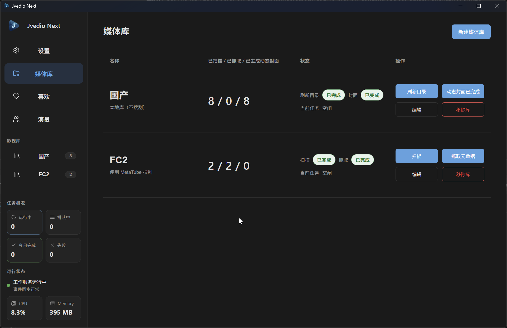
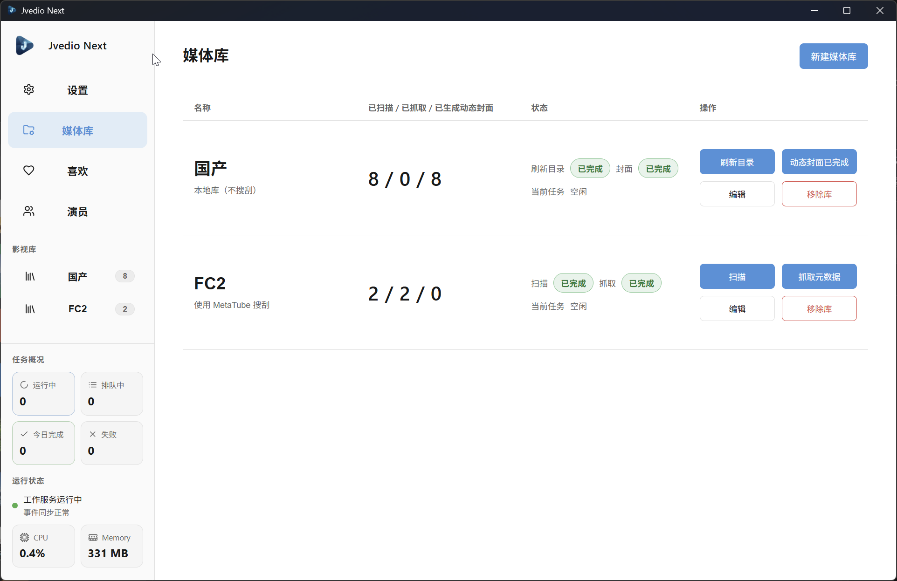
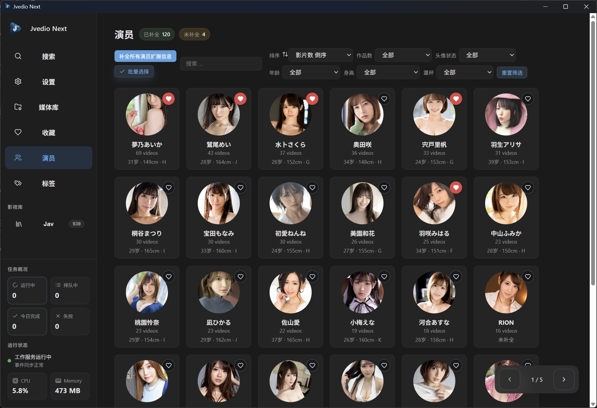
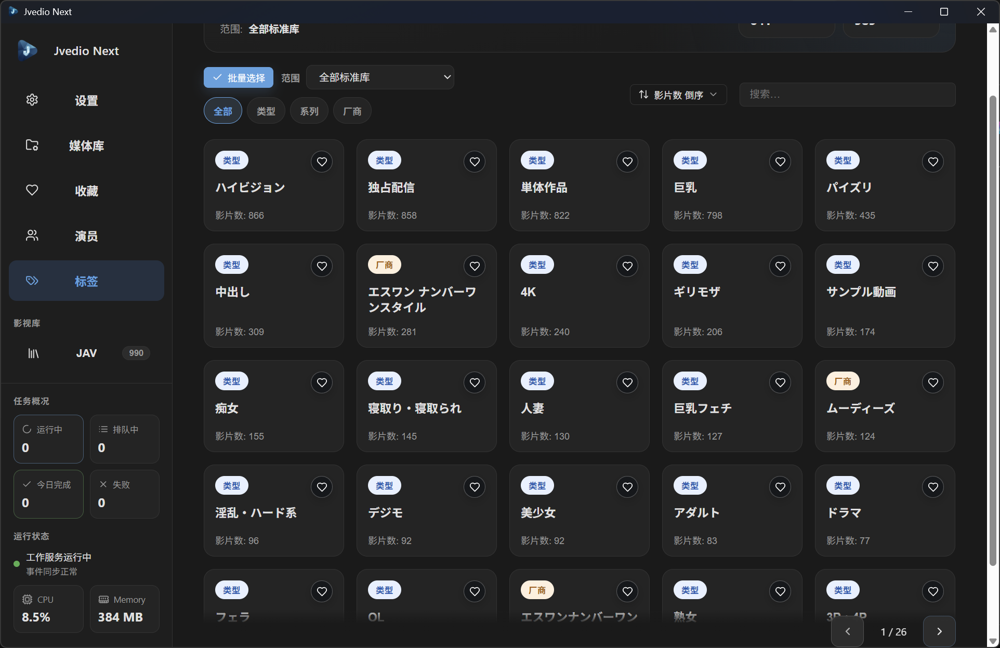
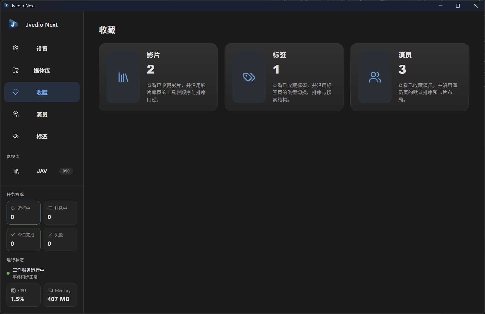
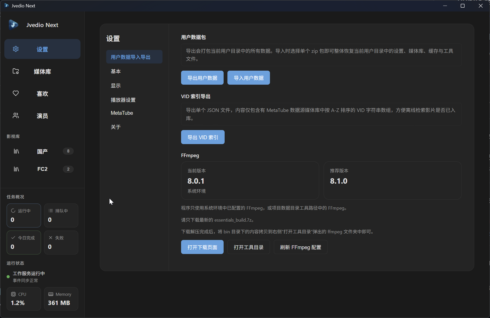
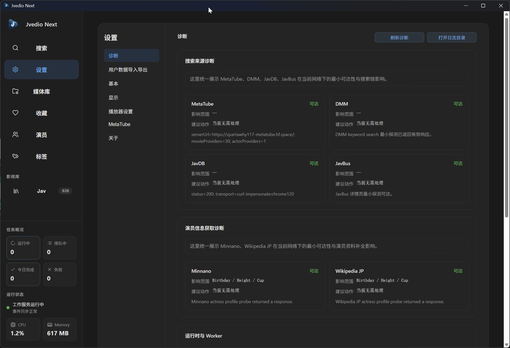

<h1 align="center">
  
  <br>
  JvedioNext
</h1>

<p align="center">
  次世代离线影片管理工具，兼容 MDCX 已整理目录、标准番号库、非规则本地资源与 `.strm` 远程索引
</p>

<p align="center">
  <a href="https://github.com/spartawhy117/JvedioNext/releases/latest">最新版本下载</a>
  ·
  <a href="https://github.com/spartawhy117/JvedioNext/wiki/User-Guide">使用指南</a>
  ·
  <a href="./standard-library-naming-rules.md">标准库命名规则</a>
  ·
  <a href="./CHANGELOG.md">版本更新记录</a>
</p>

<p align="center">
  
  
  
  
  <a href="https://github.com/spartawhy117/JvedioNext/releases/latest">
    
  </a>
  <a href="https://github.com/spartawhy117/JvedioNext">
    
  </a>
</p>

当资源越来越多以后，`JvedioNext` 重点解决的是：怎么找、怎么补、怎么整理、怎么迁移。

- **标准库**：提供 `MetaTube 抓取` 与 `MDCX 抓取` 两种目录来源；前者可整理并抓取资料，后者只读导入已有资料
- **非标准本地库**：面向论坛或社区下载的国产、OF 等非标准 JAV 电影数据，保留原目录结构，按自己的分类、合集和自定义标签管理
- **搜索页**：按 `VID`、演员原词和 `Tag` 原词搜索远端影片，并显示标准库已存在、本地库已存在、已收藏或未入库，方便按演员或标签查漏补库
- **演员页**：补全演员扩展信息，并按年龄、身高和罩杯筛选
- **标签页 / 收藏页**：统一浏览、收藏和回看影片、标签与演员
- **库健康**：集中查看抓取状态、资源缺口、规则问题、失效记录和分组一致性
- **用户数据**：支持导入导出打包，保留媒体库、影片资料、演员资料、标签与收藏关系、封面缓存和主要配置

---

## 适合这些场景

- 你有一套按番号整理或准备整理的标准影片目录，希望自动补齐元数据和 sidecar
- 你有一批网盘导出的规范 `.strm` 文件，希望继续进入海报墙、详情页和随机选片
- 你有从论坛或社区下载的国产、OF 等非标准 JAV 数据，希望不改原目录，按自己的分类、合集和标签管理

---

## 和通用媒体库的区别

Jellyfin 这类工具更适合做家庭媒体服务器和播放入口；`JvedioNext` 更偏向本地影片库的整理和维护：扫描、抓取、补资料、查缺口、维护演员和标签、迁移自己的库。

---

<a id="preview"></a>
## 预览

<p align="center">
  
  
</p>

<p align="center">
  
  
</p>

<p align="center">
  
  
</p>

<p align="center">
  
  
</p>

---

## 快速查看

### 新用户先看

- [最新版本下载](https://github.com/spartawhy117/JvedioNext/releases/latest)
- [首次启动前请先准备环境](#environment)
- [使用指南](https://github.com/spartawhy117/JvedioNext/wiki/User-Guide)
- [两种库模式速览](#library-modes-quick)
- [MDCX 兼容使用说明](./doc/wiki/mdcx-compatibility-guide.md)
- [标准库命名规则](./standard-library-naming-rules.md)

### 功能预览

- [预览图](#preview)
- [完整使用指南](https://github.com/spartawhy117/JvedioNext/wiki/User-Guide)
- [核心页面概览](#core-overview)
- [库模式说明](#library-modes-detail)

### 其他

- [架构概览](#architecture-overview)
- [特别声明](#disclaimer)
- [致谢](#acknowledgements)
- [赞助开发者喝奶茶](#support)

---

## 标准库命名规则摘要

- 支持：常见标准番号、`FC2-PPV`、已确认的数字前缀素人番号、带明确厂商或来源信号的无码番号
- Caribbeancom：支持 `CARIBBEANCOM-MMDDYY-NNN` 横线日期号；显式 Caribbeancom 前缀配下划线日期号会提示厂商格式冲突
- 需要补充信号：无码样本必须能从文件名识别厂商、来源或已登记系列号，才会进入标准库抓取主链
- 不支持自动入库：裸日期号无码不会直接作为标准库 `VID` 抓取
- `.strm` 也必须遵循标准库命名规则，且文件内容只支持单行绝对 `http/https` 地址
- 详细支持范围、后缀规则和不支持情况见：[标准库命名规则](./standard-library-naming-rules.md)

---

<a id="environment"></a>
## 首次启动前请先准备环境

默认推荐安装 `x64` 版本；如果你的系统是 `32` 位 Windows，请自行改装对应的 `x86` 版本。

### 启动必选

- `.NET 8 ASP.NET Core Runtime (Windows x64)`：
  [官方下载页（安装最新 `.NET 8.x` Windows x64 版本）](https://dotnet.microsoft.com/zh-cn/download/dotnet/8.0)
- `.NET 8 Desktop Runtime (Windows x64)`：
  [官方下载页（安装最新 `.NET 8.x` Windows x64 版本）](https://dotnet.microsoft.com/zh-cn/download/dotnet/8.0)

缺少以上任一 `.NET 8` 运行时，`Jvedio.Worker.exe` 都可能无法正常启动，通常会看到：

```text
引擎启动失败
Worker process exited unexpectedly

请检查 Worker 是否可用后重启应用
```

### 标准库抓取需要

应用可以在没有 `MetaTube` 的情况下启动。使用标准库元数据抓取、远端搜索和补资源功能时，需要在设置页填写 `MetaTube 服务地址`。

- `JvedioNext` 不内置公共 `MetaTube` 后端
- 自己搭建可参考 [MetaTube 官方文档](https://metatube-community.github.io/) 和 [MetaTube 官方 GitHub](https://github.com/metatube-community)
- 也可以自行搜索可用公共接口，常用关键词：`MetaTube 部署`、`MetaTube Docker`、`MetaTube 服务地址`、`MetaTube 公共节点`

### 可选

- `Microsoft Edge WebView2 Runtime`：[微软官方 WebView2 下载页](https://developer.microsoft.com/en-us/microsoft-edge/webview2)
  - Windows 10 和 Windows 11 通常已经自带
  - 只有在前端窗口打不开、白屏或界面无法渲染时再补装

- `FFmpeg`：[GyanD FFmpeg builds](https://www.gyan.dev/ffmpeg/builds/)
  - 生成卡片悬停预览视频时需要；本地库同时用它生成静态封面
  - 建议下载最新的 `release essentials` 压缩包
  - 解压后，把 `bin` 目录下的 `ffmpeg.exe`、`ffprobe.exe`、`ffplay.exe` 放到软件目录中的 `data/<user>/tools/ffmpeg/`
  - 不确定目录位置时，可先打开软件设置页中的 `打开工具目录`

---

<a id="library-modes-quick"></a>
## 媒体库与目录源速览

| 媒体库 / 目录来源 | 适合内容 | 元数据抓取 | 是否整理目录 | 是否删除原片 |
| --- | --- | --- | --- | --- |
| 标准库 / MetaTube 抓取 | 规范番号影片、规范命名 `.strm` | 需要 `MetaTube` | 会整理到标准库结构 | 扫描阶段不自动删除 |
| 标准库 / MDCX 抓取 | MDCX 抓取输出且含 NFO 或本地图片的影片 | 先读本地 NFO；可按需补空字段 | 不整理，不写入 | 不删除原目录和原文件 |
| 非标准本地库 | 论坛或社区下载的国产、OF 等非标准 JAV 数据 | 不需要 | 只同步，不搬运 | 不删除原目录和原文件 |

### `.strm` 支持速览

- 当前 `.strm` 支持只适用于 `MetaTube` 标准库
- 文件名需要遵循标准库命名，文件内容只支持单行绝对 `http/https` 地址
- 详细写法与命名边界见：[标准库命名规则](./standard-library-naming-rules.md)

<a id="core-overview"></a>
## 核心页面概览

### 演员页

- 补全演员扩展信息，可获取年龄、身高和罩杯
- 支持按年龄、身高、罩杯、作品数量和头像状态筛选
- 批量补全过程中可查看已补全、未补全和当前进度

### 库健康页

- 可从媒体库管理页的 `查看健康`，或单库页工具栏中的 `库健康` 进入
- 标准库集中展示抓取状态、资源缺口、规则问题、失效记录和分组一致性
- 本地库保留本地资源诊断和刷新入口，不显示依赖 `MetaTube` 抓取的标准库修复动作

### 设置页

| 分组 | 说明 |
| --- | --- |
| 用户数据导入导出 | 迁移、备份、恢复用户环境，含封面缓存和 `VID` 列表导出 |
| 基本 | 主题、语言、关闭行为、调试模式 |
| 显示 | 影片卡大小、海报样式、影片库和演员页默认排序 |
| 播放器设置 | 自定义播放器路径，未配置时回退系统默认 |
| MetaTube | 服务地址、请求超时、连通性测试 |
| 诊断 | 查看 `.NET Runtime`、`MetaTube`、`FFmpeg` 和搜索来源状态 |
| 关于 | 查看版本，跳转 GitHub Releases 获取更新 |

### 收藏页

- 影片、标签和演员都可以加入收藏
- 收藏首页提供 `影片 / 标签 / 演员` 三类入口
- 收藏影片页支持搜索、排序、批量取消收藏和批量处理

### 搜索页

- 按单个 `VID`、单个演员原词和单个 `Tag` 原词搜索远端影片
- 直接显示 `标准库已存在 / 本地库已存在 / 已收藏 / 未入库` 四类本地状态
- 结果卡支持查看远端详情、打开本地影片、补抓已有影片和打开来源页
- 演员和 `Tag` 搜索优先建议使用日文原词或站点原词

### 标签页

- 按 `类型 / 系列 / 厂商 / 自定义` 浏览标签内容
- 自定义标签同时支持标准库与非标准库
- 支持从标签继续展开关联影片，并在“全部标准库”与单库范围内切换

---

<a id="library-modes-detail"></a>
## 库模式说明

### 标准库

适合按番号管理的影片目录。添加扫描目录时，可按目录来源选择 `MetaTube 抓取` 或 `MDCX 抓取`。

#### MetaTube 抓取

适合尚未整理的规范番号影片。推荐先 `扫描` 确认入库正确，再 `抓取元数据` 补齐详情。

- 合法单文件与合法子集文件会整理到同一数据源内的基准 `VID` 目录
- 扫描阶段不会自动删除用户磁盘上的原影片文件
- 抓取后的 `NFO` 与三张主图会写回影片所在的基准 `VID` 目录
- 演员头像统一缓存在软件数据目录中，不写回影片目录
- 可在库管理中主动生成卡片悬停预览视频；生成结果只保存到软件缓存，`.strm` 不生成本地预览
- `编辑` 可修改库名和扫描目录；`移除库` 只删除软件内引用，不删除原影片和 sidecar 文件

#### MDCX 抓取

适合已由 MDCX 抓取完成的输出目录。将扫描目录设为 `MDCX 抓取` 后点击 `扫描`，即可导入 NFO、已有本地图片和演员关联。

- `扫描` 只在首次接入或 NFO 变化后同步信息，不会移动、改名、删除文件，也不会改写 NFO 或图片
- `抓取元数据` 是可选补全动作，只为身份明确的影片补充 NFO 缺失的资料
- 可在库管理中主动生成卡片悬停预览视频；只读取影片，预览缓存不写入 MDCX 目录
- MDCX 新增影片或修改 NFO 后，需要再次点击 `扫描`；浏览、搜索和重启不会隐式读取 NFO
- 目录结构、按钮行为与迁移边界见：[MDCX 兼容使用说明](./doc/wiki/mdcx-compatibility-guide.md)

### 非标准本地库

适合从论坛或社区下载的国产、OF 等非标准 JAV 电影数据。这类资源通常没有稳定番号、没有可直接搜刮的标准元数据，更适合保留原目录结构，并按自己的分类、合集和自定义标签进行管理。推荐先 `刷新目录` 确认展示正确，再按需 `生成预览视频`。

- 配置 1 条扫描目录，刷新目录只同步文件变化，不移动、不重命名、不按 `VID` 整理原文件
- 可选填“合集目录列表”，将指定路径显示为合集入口；未命中的影片默认平铺
- 支持勾选“下一层子目录按合集显示”，实现 合集 -> 子合集 -> 影片 的多级浏览
- `FFmpeg` 会生成静态封面和悬停预览；缓存只在软件数据目录，不改动原影片目录
- `编辑` 可修改库名、扫描目录和合集规则；`移除库` 只清理软件内数据和缓存，不删除原影片

<a id="architecture-overview"></a>
## 架构概览

`JvedioNext` 是一个 Windows 桌面应用，不是多条产品线。界面由 Tauri 桌面壳承载，本地 `.NET 8 Worker` 负责扫描、抓取、数据库、缓存、导入导出和后台任务。

所以首次启动需要 `.NET 8` 运行时；标准库抓取和远端搜索需要配置 `MetaTube`；需要生成卡片悬停预览时需要配置 `FFmpeg`。

---

<a id="acknowledgements"></a>
## 致谢

本项目在开发过程中参考了以下优秀开源项目，在此表示感谢：

- [clash-verge-rev](https://github.com/clash-verge-rev/clash-verge-rev) — Tauri 2 桌面应用架构与前端工程实践参考
- [metatube-sdk-go](https://github.com/metatube-community/metatube-sdk-go) — 元数据搜刮能力支持
- [jvedio](https://github.com/hitchao/jvedio) — 原版 jvedio 提供了离线影片管理的核心理念参考

---

<a id="disclaimer"></a>
## 特别声明

本软件（JvedioNext）**仅用于管理用户个人本地影片**，所有数据处理均在本地离线运行。

本软件**不提供任何非法内容分享功能**，不内置任何影片资源，不具备上传、分发或传播影片内容的能力。用户须自行确保所管理的内容符合所在地区的法律法规，开发者对用户的使用行为不承担任何法律责任。

---

<a id="support"></a>
## 赞助开发者喝奶茶

<details>
<summary>点击展开收款码</summary>

如果这个项目帮你省下了一些整理和排错时间，欢迎扫码支持开发者继续维护。

<p align="center">
  
</p>

</details>

---

<!-- repo-report:start -->
## 开发简报

> 自动更新：2026/04/13 01:36（Asia/Shanghai）

累计：版本发布数 33，已完成 Issue 13，未计划 Issue 1

当周（最近 7 天）：版本发布数 7，已完成 Issue 5，未计划 Issue 1
<!-- repo-report:end -->
